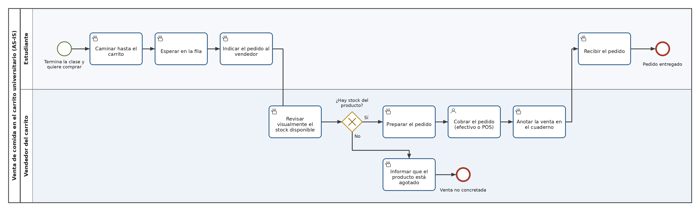

# Proceso de negocio — AS-IS

[← Volver al documento maestro](./IngReq-Entrega%201.md)

## Macro-proceso y proceso específico

**Macro-proceso:** Operación comercial del carrito de comida universitario (abastecimiento → venta → cierre de caja).

**Proceso específico que se modela:** Atención y venta de un pedido en el carrito, desde que el estudiante decide comprar hasta que recibe su pedido o desiste de la compra.

El proceso se modela en el momento de mayor carga: los 15 minutos siguientes al término de un bloque de clases, cuando la demanda del carrito se concentra casi por completo.

## Objetivo de negocio del proceso

Vender la mayor cantidad posible de productos preparados durante las ventanas de alta demanda, con el stock limitado que el carrito transporta cada día, manteniendo un tiempo de atención por estudiante que la fila tolere y un registro de ventas suficiente para reponer al día siguiente.

El proceso se considera exitoso cuando el estudiante recibe el producto que quería dentro de su tiempo disponible entre clases, y el vendedor termina la jornada con el stock vendido y registrado.

## Participantes y sus objetivos

| Participante | Objetivo en el proceso |
|---|---|
| Estudiante | Comprar el producto que quiere y retirarlo dentro del tiempo libre que tiene entre clases, sin perder el siguiente bloque ni quedarse sin almuerzo. |
| Vendedor del carrito | Atender a la mayor cantidad de estudiantes por ventana de demanda, vender todo el stock del día y saber qué se vendió para reponer. |
| Encargado/dueño del carrito | Maximizar las ventas por jornada, reducir las ventas perdidas por fila o por quiebre de stock, y decidir la reposición con información confiable. |
| Universidad (participante externo) | Evitar aglomeraciones en el acceso al campus y atrasos de estudiantes al bloque siguiente. |

## Diagrama AS-IS

Archivo fuente: [`./diagramas/as-is.bpmn`](./diagramas/as-is.bpmn)

**Tipos de tarea usados en el diagrama**

| Tarea | Tipo BPMN | Por qué |
|---|---|---|
| Caminar hasta el carrito | Manual Task | La ejecuta una persona sin apoyo de ningún sistema. |
| Esperar en la fila | Manual Task | Espera física del estudiante, sin sistema de apoyo. |
| Indicar el pedido al vendedor | Manual Task | Comunicación verbal, sin soporte de sistema. |
| Revisar visualmente el stock disponible | Manual Task | El vendedor mira la bandeja; no consulta ningún registro. |
| Preparar el pedido | Manual Task | Trabajo físico del vendedor sin apoyo de sistema. |
| Cobrar el pedido (efectivo o POS) | User Task | La ejecuta el vendedor con apoyo de un sistema externo (máquina POS / app de transferencias). |
| Informar que el producto está agotado | Manual Task | Comunicación verbal del vendedor. |
| Anotar la venta en el cuaderno | Manual Task | Registro en papel, sin sistema. |
| Recibir el pedido | Manual Task | Entrega en mano, sin sistema. |

En el AS-IS **no existe ninguna Service Task**: ese es precisamente el diagnóstico del proceso. La única tecnología presente es el POS de un tercero, que apoya al vendedor pero no ejecuta ninguna actividad del proceso de forma autónoma.

## Problemas identificados

- **P1 — La espera en fila consume el tiempo libre del estudiante.** Asociado al objetivo del *Estudiante*. La demanda se concentra en pocos minutos y la atención es estrictamente secuencial: un estudiante a la vez ocupa al vendedor durante el pedido, la preparación, el cobro y el registro.
- **P2 — El estudiante descubre el quiebre de stock recién al llegar al mesón.** Asociado a los objetivos del *Estudiante* y del *Encargado*. La verificación de disponibilidad ocurre al final del recorrido del estudiante, después de que ya caminó y esperó. Cuando falla, todo el tiempo invertido se pierde y la venta no se concreta.
- **P3 — Se pierden ventas por abandono de fila.** Asociado al objetivo del *Encargado*. Estudiantes que ven la fila desde lejos no se incorporan, y esa demanda no queda registrada en ninguna parte.
- **P4 — El registro de ventas en cuaderno es lento y poco confiable.** Asociado al objetivo del *Vendedor*. Anotar cada venta en papel agrega tiempo dentro de la ventana crítica, y en horas peak simplemente se omite, lo que deja al encargado sin datos para reponer.
- **P5 — El vendedor no conoce la demanda antes de que ocurra.** Asociado al objetivo del *Vendedor*. La preparación empieza recién cuando el estudiante llega al mesón; no hay forma de adelantar trabajo aunque la demanda sea perfectamente previsible por el horario de clases.
- **P6 — El proceso no es escalable.** Asociado al objetivo del *Encargado*. Atender más estudiantes exige más personas en el carrito, porque no hay ningún componente del proceso que pueda absorber volumen sin agregar trabajo humano.
