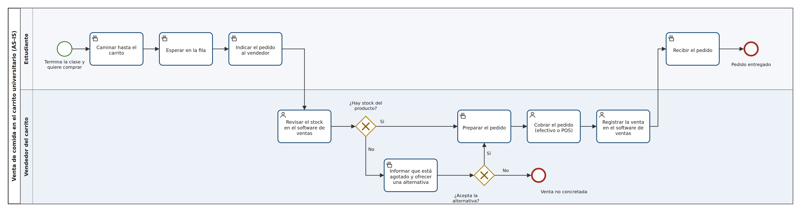

# Proceso de negocio — AS-IS

[← Volver al documento maestro](./IngReq-Entrega%201.md)

## Macro-proceso y proceso específico

**Macro-proceso:** Operación comercial del carrito de comida universitario → abastecimiento del día → **atención y venta** → cierre de caja y reposición.

**Proceso específico que se modela:** Atención y venta de un pedido en el carrito, desde que el estudiante termina su clase y decide comprar hasta que recibe su pedido (*Pedido entregado*) o se va sin él porque el producto se agotó (*Venta no concretada*).

**Momento que se modela:** la ventana de mayor carga, es decir, los 15 minutos siguientes al término de un bloque de clases, cuando la demanda del carrito se concentra casi por completo.

**Fuera del alcance del modelo:** el abastecimiento previo (qué y cuánto trae el vendedor cada día) y el cierre de caja. Se mencionan porque dependen del registro de ventas que se genera dentro del proceso modelado (ver P4).

## Objetivo de negocio del proceso

Vender la mayor cantidad posible de productos preparados durante las ventanas de alta demanda, con el stock limitado que el carrito transporta cada día, manteniendo un tiempo de atención por estudiante que la fila tolere y un registro de ventas suficiente para decidir la reposición del día siguiente.

El proceso se considera exitoso cuando el estudiante recibe el producto que quería dentro de su tiempo disponible entre clases, y el vendedor termina la jornada con el stock vendido y registrado.

## Participantes y sus objetivos

| Participante | Objetivo en el proceso | Presencia en el diagrama |
|---|---|---|
| Estudiante | Comprar el producto que quiere y retirarlo dentro del tiempo libre que tiene entre clases, sin perder el siguiente bloque ni quedarse sin almuerzo. | Carril *Estudiante* |
| Vendedor del carrito | Atender a la mayor cantidad de estudiantes por ventana de demanda, vender todo el stock del día y saber qué se vendió para reponer. | Carril *Vendedor del carrito* |
| Encargado/dueño del carrito | Maximizar las ventas por jornada, reducir las ventas perdidas por fila o por quiebre de stock y decidir la reposición con información confiable. | No ejecuta tareas en la ventana modelada; es quien usa el registro del cuaderno. |
| Universidad (participante externo) | Evitar aglomeraciones en el acceso al campus y atrasos de estudiantes al bloque siguiente. | No ejecuta tareas; recibe el efecto de la fila. |

El encargado y la universidad no tienen carril propio porque no ejecutan actividades dentro del proceso modelado. Se incluyen porque sus objetivos se ven afectados por él y dan origen a los problemas P3, P4 y P6 y a parte de las mejoras del TO-BE.

## Diagrama AS-IS

Archivo fuente: [`./diagramas/as-is.bpmn`](./diagramas/as-is.bpmn)

### Descripción del flujo

1. El proceso comienza cuando **termina la clase y el estudiante quiere comprar** (evento de inicio).
2. El estudiante **camina hasta el carrito**, **espera en la fila** y, cuando llega su turno, **indica el pedido al vendedor** de forma verbal.
3. Recién entonces el vendedor **revisa visualmente el stock disponible** en la bandeja.
4. Compuerta exclusiva **¿Hay stock del producto?**
   - **No:** el vendedor **informa que el producto está agotado** y el proceso termina en **Venta no concretada**. El estudiante ya invirtió el tiempo de caminar y de esperar.
   - **Sí:** el vendedor **prepara el pedido**, **cobra el pedido (efectivo o POS)** y **anota la venta en el cuaderno**. El estudiante **recibe el pedido** y el proceso termina en **Pedido entregado**.

Todas las actividades del vendedor ocurren con el estudiante frente al mesón, **una venta a la vez**: mientras se prepara, se cobra y se anota una venta, el resto de la fila espera.

### Tipos de tarea usados en el diagrama

| Tarea | Carril | Tipo BPMN | Por qué |
|---|---|---|---|
| Caminar hasta el carrito | Estudiante | Manual Task | La ejecuta una persona sin apoyo de ningún sistema. |
| Esperar en la fila | Estudiante | Manual Task | Espera física del estudiante, sin sistema de apoyo. |
| Indicar el pedido al vendedor | Estudiante | Manual Task | Comunicación verbal, sin soporte de sistema. |
| Revisar visualmente el stock disponible | Vendedor | Manual Task | El vendedor mira la bandeja; no consulta ningún registro. |
| Informar que el producto está agotado | Vendedor | Manual Task | Comunicación verbal del vendedor. |
| Preparar el pedido | Vendedor | Manual Task | Trabajo físico del vendedor sin apoyo de sistema. |
| Cobrar el pedido (efectivo o POS) | Vendedor | User Task | La ejecuta el vendedor con apoyo de un sistema externo (máquina POS o app de transferencias). |
| Anotar la venta en el cuaderno | Vendedor | Manual Task | Registro en papel, sin sistema. |
| Recibir el pedido | Estudiante | Manual Task | Entrega en mano, sin sistema. |

En el AS-IS **no existe ninguna Service Task**, y ese es precisamente el diagnóstico del proceso. La única tecnología presente es el POS de un tercero: apoya al vendedor en el cobro, pero no ejecuta de forma autónoma ninguna actividad del proceso. Toda la verificación de stock, el registro y la coordinación dependen del trabajo humano.

## Problemas identificados

- **P1 — La espera en fila consume el tiempo libre del estudiante.** Asociado al objetivo del *Estudiante* (y, de forma indirecta, al de la *Universidad*). La demanda se concentra en pocos minutos y la atención es estrictamente secuencial: cada estudiante ocupa al vendedor durante el pedido, la preparación, el cobro y el registro.
- **P2 — El estudiante descubre el quiebre de stock recién al llegar al mesón.** Asociado a los objetivos del *Estudiante* y del *Encargado*. La verificación de disponibilidad ocurre al final del recorrido del estudiante, después de que ya caminó y esperó. Cuando falla, todo el tiempo invertido se pierde y la venta no se concreta.
- **P3 — Se pierden ventas por abandono de fila.** Asociado al objetivo del *Encargado*. Estudiantes que ven la fila desde lejos no se incorporan, y esa demanda, al igual que las ventas no concretadas por quiebre, no queda registrada en ninguna parte.
- **P4 — El registro de ventas en cuaderno es lento y poco confiable.** Asociado a los objetivos del *Vendedor* y del *Encargado*. Anotar cada venta en papel agrega tiempo dentro de la ventana crítica y en horas peak simplemente se omite, lo que deja al encargado sin datos para reponer.
- **P5 — El vendedor no conoce la demanda antes de que ocurra.** Asociado al objetivo del *Vendedor*. La preparación empieza recién cuando el estudiante llega al mesón; no hay forma de adelantar trabajo, aunque la demanda sea previsible por el horario de clases.
- **P6 — El proceso no es escalable.** Asociado al objetivo del *Encargado*. Atender más estudiantes exige más personas en el carrito, porque ningún componente del proceso puede absorber volumen sin agregar trabajo humano.

### Dónde se origina cada problema en el modelo

| Problema | Participante afectado | Actividad(es) o elemento del AS-IS donde se origina |
|---|---|---|
| P1 | Estudiante, Universidad | Esperar en la fila; secuencia Preparar → Cobrar → Anotar con el estudiante presente |
| P2 | Estudiante, Encargado | Revisar visualmente el stock disponible, ubicada después de Caminar y Esperar; compuerta ¿Hay stock del producto? → Venta no concretada |
| P3 | Encargado | Esperar en la fila (demanda que no entra al proceso); Venta no concretada sin registro |
| P4 | Vendedor, Encargado | Anotar la venta en el cuaderno |
| P5 | Vendedor | Preparar el pedido, que solo puede iniciarse después de Indicar el pedido al vendedor |
| P6 | Encargado | Todo el carril del vendedor: solo tareas manuales o de usuario, sin tareas de servicio |

Estos problemas son el punto de partida de las mejoras e iniciativas de [`02-rediseno-to-be.md`](./02-rediseno-to-be.md).
