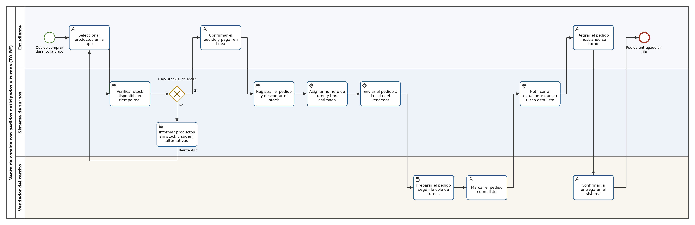

# Análisis de rediseño y propuesta TO-BE

[← Volver al documento maestro](./IngReq-Entrega%201.md)

## Mejoras identificadas por participante

| Participante | Objetivo | Problema | Mejora deseada |
|---|---|---|---|
| Estudiante | Comer dentro del tiempo libre entre clases | P1 — La fila consume casi todo el tiempo disponible | Poder pedir y pagar antes de salir de clase y solo pasar a retirar |
| Estudiante | Comprar el producto que quiere | P2 — Descubre el quiebre de stock al llegar al mesón | Ver la disponibilidad real antes de desplazarse |
| Vendedor | Atender a más estudiantes por ventana de demanda | P1, P5 — Atención secuencial y sin anticipación de la demanda | Conocer los pedidos antes del término del bloque y preparar por cola |
| Vendedor | Saber qué se vendió para reponer | P4 — El registro en cuaderno es lento y se omite en peak | Que la venta quede registrada sola al confirmarse el pedido |
| Encargado/dueño | Reducir las ventas perdidas | P3 — Abandono de fila y quiebres invisibles | Capturar la demanda que hoy no se materializa y medirla |
| Encargado/dueño | Crecer sin multiplicar el personal | P6 — El proceso no escala | Que el volumen adicional lo absorba el sistema, no más vendedores |
| Universidad | Evitar aglomeraciones en el acceso | P1 — Fila en la vereda de entrada | Distribuir los retiros en el tiempo mediante turnos |

## Iniciativas de rediseño

Las heurísticas citadas corresponden al catálogo de mejores prácticas de rediseño de procesos de negocio (Reijers & Liman Mansar).

### Iniciativa 1 — Verificar el stock antes de que el estudiante se desplace

- **Actividad(es) del AS-IS que afecta:** "Revisar visualmente el stock disponible" (Vendedor) y "Esperar en la fila" (Estudiante).
- **Heurística aplicada:** *Knock-out* (reordenar los puntos de descarte: ejecutar primero la condición que descarta más casos y que tiene menor costo de ejecución).
- **Objetivo o mejora que resuelve:** P2 — el estudiante descubre el quiebre de stock recién al llegar al mesón, después de haber caminado y esperado.
- **Efecto esperado:** **Tiempo** — elimina el desplazamiento y la espera en los casos que terminan en quiebre. **Calidad** — el estudiante nunca recorre el proceso completo para recibir un "no hay". El chequeo pasa a costar cero trabajo humano al automatizarse (Iniciativa 3).

### Iniciativa 2 — Que el propio estudiante ingrese y pague su pedido

- **Actividad(es) del AS-IS que afecta:** "Indicar el pedido al vendedor" (Estudiante) y "Cobrar el pedido" (Vendedor).
- **Heurística aplicada:** *Integración con el cliente / traspaso de tareas al cliente* (el cliente ejecuta parte del proceso que antes ejecutaba la organización), combinada con *Reducción de contactos* (menos interacciones entre cliente y organización).
- **Objetivo o mejora que resuelve:** P1 y P5 — la toma de pedido y el cobro ocupan al vendedor dentro de la ventana crítica, uno por uno.
- **Efecto esperado:** **Tiempo** — saca del mesón dos de las cuatro actividades que hoy ocupan al vendedor por cada venta. **Costo** — más ventas por vendedor sin contratar personal. **Calidad** — el pedido queda escrito por quien lo hace, lo que elimina los errores de comunicación verbal en un entorno ruidoso.

### Iniciativa 3 — Automatizar el registro de la venta y el descuento de stock

- **Actividad(es) del AS-IS que afecta:** "Anotar la venta en el cuaderno" (Vendedor) y "Revisar visualmente el stock disponible" (Vendedor).
- **Heurística aplicada:** *Automatización de tareas* (dejar que un sistema ejecute las tareas que no requieren juicio humano).
- **Objetivo o mejora que resuelve:** P4 — el registro manual es lento, se omite en horas peak y deja al encargado sin datos de reposición.
- **Efecto esperado:** **Tiempo** — elimina una actividad completa del camino crítico del vendedor. **Calidad** — el inventario queda siempre consistente con lo vendido, que es la condición para que la Iniciativa 1 sea confiable. **Flexibilidad** — habilita reportes de demanda para decidir la reposición.

### Iniciativa 4 — Desacoplar el pedido del retiro mediante turnos

- **Actividad(es) del AS-IS que afecta:** "Esperar en la fila" (Estudiante) y "Preparar el pedido" (Vendedor).
- **Heurística aplicada:** *Resecuenciación* (mover actividades a un punto más conveniente del proceso) y *Paralelismo* (ejecutar en paralelo actividades que hoy son secuenciales).
- **Objetivo o mejora que resuelve:** P1 y P5 — hoy la preparación solo puede empezar cuando el estudiante ya está en el mesón.
- **Efecto esperado:** **Tiempo** — la preparación ocurre mientras el estudiante todavía está en clase y mientras camina; el tiempo de ciclo percibido por el estudiante baja al tiempo de retiro. **Flexibilidad** — los retiros se distribuyen en el tiempo en vez de concentrarse en el minuto de salida.

### Iniciativa 5 — Notificar el turno en lugar de hacer que el estudiante consulte

- **Actividad(es) del AS-IS que afecta:** "Esperar en la fila" (Estudiante) — la espera presencial es, en el fondo, un mecanismo de consulta continua del estado del pedido.
- **Heurística aplicada:** *Buffering* (suscribirse a la información en vez de solicitarla cada vez).
- **Objetivo o mejora que resuelve:** P1 y el objetivo de la Universidad de evitar aglomeraciones.
- **Efecto esperado:** **Tiempo** — el estudiante no gasta tiempo esperando para saber si su pedido está listo. **Calidad** — la experiencia de espera deja de ocurrir en la vereda.

### Iniciativa 6 — Soportar el proceso con una plataforma única

- **Actividad(es) del AS-IS que afecta:** todo el proceso; en particular las actividades que hoy no tienen soporte de sistema.
- **Heurística aplicada:** *Tecnología integral* (introducir tecnología que habilita nuevas formas de ejecutar el proceso, no solo que acelera las existentes).
- **Objetivo o mejora que resuelve:** P6 — el proceso no escala porque todo su volumen se apoya en trabajo humano.
- **Efecto esperado:** **Flexibilidad** — el mismo proceso soporta un carrito o varios puntos de venta agregando configuración y no personas. **Costo** — el costo marginal por pedido adicional tiende a cero en las actividades automatizadas.

## Diagrama TO-BE

Archivo fuente: [`./diagramas/to-be.bpmn`](./diagramas/to-be.bpmn)

**Tipos de tarea usados en el diagrama**

| Tarea | Tipo BPMN | Por qué |
|---|---|---|
| Seleccionar productos en la app | User Task | La ejecuta el estudiante con apoyo del sistema. |
| Verificar stock disponible en tiempo real | Service Task | La ejecuta el sistema automáticamente contra el inventario. |
| Informar productos sin stock y sugerir alternativas | Service Task | Respuesta automática del sistema. |
| Confirmar el pedido y pagar en línea | User Task | La ejecuta el estudiante con apoyo del sistema y la pasarela de pago. |
| Registrar el pedido y descontar el stock | Service Task | Transacción automática, sin intervención humana. |
| Asignar número de turno y hora estimada | Service Task | Cálculo automático a partir de la cola y los tiempos de preparación. |
| Enviar el pedido a la cola del vendedor | Service Task | Notificación automática al panel del vendedor. |
| Preparar el pedido según la cola de turnos | Manual Task | Trabajo físico del vendedor; el sistema le indica el orden, pero no lo asiste en la preparación. |
| Marcar el pedido como listo | User Task | La ejecuta el vendedor en el panel del sistema. |
| Notificar al estudiante que su turno está listo | Service Task | Envío automático de la notificación. |
| Retirar el pedido mostrando su turno | User Task | El estudiante presenta su turno desde la app. |
| Confirmar la entrega en el sistema | User Task | La ejecuta el vendedor cerrando el pedido en el sistema. |

## Actividades que cambian del AS-IS al TO-BE

| ID | Actividad en el AS-IS | Actividad en el TO-BE | Qué cambia |
|---|---|---|---|
| AC-01 | Esperar en la fila *(Manual, Estudiante)* | Seleccionar productos en la app *(User, Estudiante)* | La espera presencial se reemplaza por la selección remota del pedido durante la clase. El estudiante deja de ocupar tiempo físico en la fila. |
| AC-02 | Revisar visualmente el stock disponible *(Manual, Vendedor)* | Verificar stock disponible en tiempo real *(Service, Sistema)* | La verificación deja de ser un vistazo del vendedor al final del recorrido y pasa a ser una consulta automática al inicio, antes de que el estudiante se desplace. |
| AC-03 | Indicar el pedido al vendedor *(Manual, Estudiante)* + Cobrar el pedido *(User, Vendedor)* | Confirmar el pedido y pagar en línea *(User, Estudiante)* | La toma de pedido y el cobro dejan de ocupar al vendedor y se trasladan al estudiante, en un solo paso digital. |
| AC-04 | Anotar la venta en el cuaderno *(Manual, Vendedor)* | Registrar el pedido y descontar el stock *(Service, Sistema)* | El registro en papel se reemplaza por una transacción automática que actualiza el inventario en el mismo momento de la venta. |
| AC-05 | *(no existe en el AS-IS)* | Asignar número de turno y hora estimada *(Service, Sistema)* | Se introduce un turno con hora estimada que desacopla el momento del pedido del momento del retiro. |
| AC-06 | Preparar el pedido *(Manual, Vendedor)* | Enviar el pedido a la cola del vendedor *(Service, Sistema)* + Preparar el pedido según la cola de turnos *(Manual, Vendedor)* | La preparación deja de iniciarse con el estudiante presente y pasa a ordenarse por una cola que el vendedor recibe antes del término del bloque. |
| AC-07 | *(no existe en el AS-IS)* | Marcar el pedido como listo *(User, Vendedor)* + Notificar al estudiante que su turno está listo *(Service, Sistema)* | Se introduce un aviso push: el estudiante ya no consulta presencialmente el estado de su pedido. |
| AC-08 | Recibir el pedido *(Manual, Estudiante)* | Retirar el pedido mostrando su turno *(User, Estudiante)* + Confirmar la entrega en el sistema *(User, Vendedor)* | La entrega pasa a estar verificada contra un turno y queda cerrada en el sistema, lo que permite trazar el pedido y detectar entregas no retiradas. |

Esta tabla es la que se usa en [`03-requisitos.md`](./03-requisitos.md) y [`04-historias-usuario.md`](./04-historias-usuario.md) para asociar cada requisito e historia a la actividad que cambia.
