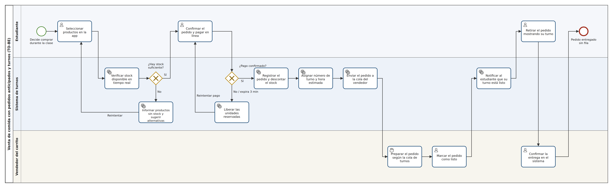

# Análisis de rediseño y propuesta TO-BE

[← Volver al documento maestro](./IngReq-Entrega%201.md)

Este documento parte de los problemas **P1–P6** identificados en [`01-proceso-as-is.md`](./01-proceso-as-is.md#problemas-identificados). Propone seis iniciativas de rediseño y las concreta en el proceso TO-BE soportado por **TurnoCarrito**, un sistema de pedidos anticipados y turnos para el carrito. Las iniciativas se contrastaron con los hallazgos de la [elicitación](./05-Elicitacion.md) (H1–H14).

## Mejoras identificadas por participante

| Participante | Objetivo | Problema | Mejora deseada |
|---|---|---|---|
| Estudiante | Comer dentro del tiempo libre entre clases | P1 — La fila consume el tiempo disponible y a veces hace llegar tarde a clase | Poder pedir y pagar antes de salir de clase y solo pasar a retirar, sin fila |
| Estudiante | Comprar el producto que quiere | P2 — Conoce la disponibilidad recién en el mesón | Ver la disponibilidad real antes de desplazarse |
| Estudiante | Confiar en que el pedido se cumpla | H12 — La desconfianza está en el cumplimiento, no en el pago | Saber en todo momento el estado de su pedido y cuándo retirarlo |
| Vendedor | Atender a más estudiantes por ventana de demanda | P1, P5 — Atención secuencial y sin anticipación de la demanda | Conocer los pedidos antes del término del bloque y preparar por cola |
| Vendedor | Saber qué se vendió para reponer | P4 — Cada venta la ingresa él, en plena ventana crítica | Que la venta quede registrada sola al confirmarse el pedido |
| Encargado/dueño | Reducir las ventas perdidas | P2, P3 — Demanda que no se concreta y no queda registrada | Medir también los pedidos rechazados por falta de stock |
| Encargado/dueño | Decidir la reposición con información confiable | P4 — El registro solo cubre ventas concretadas | Contar con un reporte de la jornada por producto y por franja horaria |
| Encargado/dueño | Crecer sin multiplicar el personal | P6 — Hoy crecer significa contratar (H7) | Que el volumen adicional lo absorba el sistema, no más vendedores |
| Universidad | Evitar aglomeraciones en el acceso | P1 — Fila en la vereda de entrada, sobre todo al almuerzo | Distribuir los retiros en el tiempo |

## Iniciativas de rediseño

Las heurísticas citadas corresponden al catálogo de mejores prácticas de rediseño de procesos de negocio de Reijers & Liman Mansar. Entre paréntesis se indica el nombre original en inglés.

### Iniciativa 1 — Verificar el stock antes de que el estudiante se desplace

- **Actividad(es) del AS-IS que afecta:** "Revisar el stock en el software de ventas" e "Informar que está agotado y ofrecer una alternativa" (Vendedor), y "Esperar en la fila" (Estudiante).
- **Heurística aplicada:** *Knock-out* (reordenar los puntos de descarte: ejecutar primero la condición que descarta más casos y que tiene menor costo de ejecución).
- **Objetivo o mejora que resuelve:** P2 — el estudiante conoce la disponibilidad recién al llegar al mesón, después de haber caminado y esperado.
- **Efecto esperado:** **Tiempo** — elimina el desplazamiento y la espera en los casos sin stock. **Calidad** — el estudiante decide con información real y recibe las alternativas en la app, como hoy las ofrece el vendedor en persona (H3). **Costo** — el chequeo lo ejecuta el sistema; el único trabajo humano es que el vendedor declare el stock al abrir la jornada.
- **Ajuste por elicitación:** el quiebre es poco frecuente y se concentra cerca del cierre (H11), así que el beneficio de esta iniciativa es mayor al final de la jornada. Se mantiene porque su costo es casi nulo una vez que existe el registro automático (Iniciativa 3) y porque es la base de la reserva de stock durante el pago.
- **Actividades TO-BE resultantes:** AC-02.

### Iniciativa 2 — Que el propio estudiante ingrese y pague su pedido

- **Actividad(es) del AS-IS que afecta:** "Indicar el pedido al vendedor" (Estudiante) y "Cobrar el pedido (efectivo o POS)" (Vendedor).
- **Heurística aplicada:** *Integración con el cliente* (*Integration*: el cliente ejecuta parte del proceso que antes ejecutaba la organización), combinada con *Reducción de contactos* (*Contact reduction*: menos interacciones entre cliente y organización).
- **Objetivo o mejora que resuelve:** P1 y P5 — la toma de pedido y el cobro ocupan al vendedor dentro de la ventana crítica, uno por uno.
- **Efecto esperado:** **Tiempo** — saca del mesón dos de las actividades que hoy ocupan al vendedor en cada venta. **Costo** — más ventas por vendedor sin contratar personal. **Calidad** — el pedido queda escrito por quien lo hace, lo que elimina errores de comunicación verbal en un entorno ruidoso.
- **Respaldo de la elicitación:** los cinco estudiantes del grupo focal pagarían por adelantado (H12).
- **Actividades TO-BE resultantes:** AC-01 y AC-03.

### Iniciativa 3 — Automatizar el registro de la venta y el descuento de stock

- **Actividad(es) del AS-IS que afecta:** "Registrar la venta en el software de ventas" y "Revisar el stock en el software de ventas" (Vendedor).
- **Heurística aplicada:** *Automatización de tareas* (*Task automation*: dejar que un sistema ejecute las tareas que no requieren juicio humano).
- **Objetivo o mejora que resuelve:** P4 — hoy el vendedor ingresa cada venta a mano dentro de la ventana crítica; y P3 — la demanda que no se concreta no queda registrada.
- **Efecto esperado:** **Tiempo** — la venta se registra sola al confirmarse el pago, sin que el vendedor la digite. **Calidad** — el inventario queda siempre consistente con lo vendido, que es la condición para que la Iniciativa 1 sea confiable. Esto incluye reservar las unidades mientras el pago está en curso y liberarlas si el pago no se confirma, para que dos pedidos simultáneos no comprometan la misma unidad. **Flexibilidad** — habilita el reporte de la jornada (ventas, ingresos y pedidos rechazados por falta de stock) para decidir la reposición.
- **Ajuste por elicitación:** el vendedor ya tiene un software de ventas (H2), así que esta iniciativa no reemplaza un cuaderno sino una digitación manual. Queda por definir con el vendedor si TurnoCarrito se integra con ese software o lo reemplaza.
- **Actividades TO-BE resultantes:** AC-04.

### Iniciativa 4 — Desacoplar el pedido del retiro mediante turnos

- **Actividad(es) del AS-IS que afecta:** "Esperar en la fila" (Estudiante), "Preparar el pedido" (Vendedor) y "Recibir el pedido" (Estudiante).
- **Heurística aplicada:** *Resecuenciación* (*Resequencing*: mover actividades a un punto más conveniente del proceso) y *Paralelismo* (*Parallelism*: ejecutar en paralelo actividades que hoy son secuenciales).
- **Objetivo o mejora que resuelve:** P1 y P5 — hoy la preparación, de 5 a 10 minutos (H6), solo puede empezar cuando el estudiante ya está en el mesón.
- **Efecto esperado:** **Tiempo** — la preparación ocurre mientras el estudiante todavía está en clase y mientras camina; el tiempo de ciclo que percibe se reduce al tiempo de retiro. **Flexibilidad** — los retiros se distribuyen en el tiempo en lugar de concentrarse en el minuto de salida. **Calidad** — la entrega se valida contra un turno, lo que evita entregar un pedido dos veces o a la persona equivocada.
- **Ajuste por elicitación:** 4 de 5 estudiantes prefieren "una fila más corta" antes que "un turno con hora estimada" (H13). Se mantiene la iniciativa, pero se precisa su sentido: el turno **no obliga al estudiante a esperar una hora fija**; es el identificador de su pedido y la forma de retirarlo **sin hacer fila**, que es justamente lo que prefieren. La hora estimada es informativa. Esta interpretación debe validarse con estudiantes antes de comprometer el alcance (RY-04).
- **Actividades TO-BE resultantes:** AC-05, AC-06 y AC-08.

### Iniciativa 5 — Notificar el turno en lugar de hacer que el estudiante consulte

- **Actividad(es) del AS-IS que afecta:** "Esperar en la fila" (Estudiante); la espera presencial es, en el fondo, un mecanismo de consulta continua del estado del pedido.
- **Heurística aplicada:** *Buffering* (suscribirse a la información en lugar de solicitarla cada vez).
- **Objetivo o mejora que resuelve:** P1 y el objetivo de la Universidad de evitar aglomeraciones.
- **Efecto esperado:** **Tiempo** — el estudiante no gasta tiempo esperando para saber si su pedido está listo. **Calidad** — la espera deja de ocurrir en la vereda de acceso, y el estudiante sabe en todo momento en qué estado está su pedido.
- **Respaldo de la elicitación:** ante un atraso, los estudiantes esperan y llegan tarde a clase (H14), y su principal desconfianza es que el pedido no se cumpla (H12). El aviso les permite quedarse en clase hasta que el pedido esté listo.
- **Actividades TO-BE resultantes:** AC-07.

### Iniciativa 6 — Soportar el proceso con una plataforma única

- **Actividad(es) del AS-IS que afecta:** todo el proceso, en particular las actividades que hoy dependen de que el vendedor opere un sistema venta a venta.
- **Heurística aplicada:** *Tecnología integral* (*Integral technology*: introducir tecnología que habilita nuevas formas de ejecutar el proceso, no solo que acelera las existentes).
- **Objetivo o mejora que resuelve:** P6 — el proceso no escala porque todo su volumen se apoya en trabajo humano.
- **Efecto esperado:** **Flexibilidad** — el mismo proceso soporta uno o varios puntos de venta agregando configuración y no personas; el vendedor puede operar desde su celular aunque la conexión sea intermitente. **Costo** — el costo marginal de cada pedido adicional tiende a cero en las actividades automatizadas.
- **Ajuste por elicitación:** hoy el vendedor resolvería el doble de demanda contratando personal (H7). La plataforma se propone como alternativa a esa contratación. Su principal preocupación es el **costo de empaque** que traerían los pedidos anticipados; no es una actividad del proceso, pero queda como riesgo a considerar en los requisitos.
- **Actividades TO-BE resultantes:** transversal. Es la plataforma que soporta AC-01 a AC-08; su carril en el diagrama es *Sistema de turnos*.

## Diagrama TO-BE

Archivo fuente: [`./diagramas/to-be.bpmn`](./diagramas/to-be.bpmn)

### Descripción del flujo

1. El proceso comienza cuando el estudiante **decide comprar durante la clase** y **selecciona productos en la app**.
2. El sistema **verifica el stock disponible en tiempo real**. Si no hay stock suficiente, **informa los productos sin stock y sugiere alternativas**, y el estudiante vuelve a seleccionar (*Reintentar*).
3. Con stock suficiente, el estudiante **confirma el pedido y paga en línea**. Mientras el pago está en curso, las unidades quedan reservadas para ese pedido.
4. Compuerta **¿Pago confirmado?**
   - **No / expira 3 min:** el sistema **libera las unidades reservadas** y el estudiante puede reintentar el pago sin rearmar el pedido.
   - **Sí:** el sistema **registra el pedido y descuenta el stock**, **asigna número de turno y hora estimada** y **envía el pedido a la cola del vendedor**.
5. El vendedor **prepara el pedido según la cola de turnos** y lo **marca como listo**; el sistema **notifica al estudiante que su turno está listo**.
6. El estudiante **retira el pedido mostrando su turno**, el vendedor **confirma la entrega en el sistema** y el proceso termina en **Pedido entregado sin fila**.

Comparado con el AS-IS, el vendedor deja de revisar el stock, tomar el pedido, cobrar y registrar la venta. Solo conserva la preparación y dos acciones breves en el panel (marcar como listo y confirmar la entrega).

### Tipos de tarea usados en el diagrama

| Tarea | Carril | Tipo BPMN | Por qué |
|---|---|---|---|
| Seleccionar productos en la app | Estudiante | User Task | La ejecuta el estudiante con apoyo del sistema. |
| Verificar stock disponible en tiempo real | Sistema de turnos | Service Task | La ejecuta el sistema automáticamente contra el inventario. |
| Informar productos sin stock y sugerir alternativas | Sistema de turnos | Service Task | Respuesta automática del sistema. |
| Confirmar el pedido y pagar en línea | Estudiante | User Task | La ejecuta el estudiante con apoyo del sistema y de la pasarela de pago. |
| Liberar las unidades reservadas | Sistema de turnos | Service Task | Si el pago falla o expira, el sistema devuelve automáticamente las unidades al stock. |
| Registrar el pedido y descontar el stock | Sistema de turnos | Service Task | Transacción automática, sin intervención humana. |
| Asignar número de turno y hora estimada | Sistema de turnos | Service Task | Cálculo automático a partir de la cola vigente y de los tiempos de preparación. |
| Enviar el pedido a la cola del vendedor | Sistema de turnos | Service Task | Notificación automática al panel del vendedor. |
| Preparar el pedido según la cola de turnos | Vendedor | Manual Task | Trabajo físico del vendedor; el sistema le indica el orden, pero no lo asiste en la preparación. |
| Marcar el pedido como listo | Vendedor | User Task | La ejecuta el vendedor en el panel del sistema. |
| Notificar al estudiante que su turno está listo | Sistema de turnos | Service Task | Envío automático de la notificación. |
| Retirar el pedido mostrando su turno | Estudiante | User Task | El estudiante presenta su turno desde la app. |
| Confirmar la entrega en el sistema | Vendedor | User Task | La ejecuta el vendedor cerrando el pedido en el sistema. |

En el AS-IS la tecnología existía, pero solo como User Tasks que el vendedor ejecuta venta a venta. El TO-BE concentra en el carril *Sistema de turnos* todas las actividades que no requieren juicio humano. Solo queda una Manual Task: la preparación física del pedido.

### Actividades de soporte fuera del flujo modelado

El diagrama modela un pedido individual. Algunas actividades ocurren una vez por jornada y no forman parte de ese flujo, pero son condición para que funcione:

| Actividad de soporte | Quién la realiza | Actividad del TO-BE que habilita |
|---|---|---|
| Abrir la jornada declarando el stock inicial por producto y ajustarlo durante el día | Vendedor | AC-02 — sin stock cargado no hay disponibilidad que verificar |
| Configurar el tiempo estándar de preparación de cada producto (hoy entre 5 y 10 minutos, H6) | Encargado | AC-05 — sin ese parámetro no se puede calcular la hora estimada |
| Consultar el reporte de la jornada (ventas, ingresos, pedidos rechazados y franjas horarias) | Encargado | AC-04 — el reporte se construye con lo que el sistema registra en cada venta |

## Actividades que cambian del AS-IS al TO-BE

| ID | Actividad en el AS-IS | Actividad en el TO-BE | Qué cambia |
|---|---|---|---|
| AC-01 | Esperar en la fila *(Manual, Estudiante)* | Seleccionar productos en la app *(User, Estudiante)* | La espera presencial se reemplaza por la selección remota del pedido durante la clase. El estudiante deja de ocupar tiempo físico en la fila. |
| AC-02 | Revisar el stock en el software de ventas *(User, Vendedor)* + Informar que está agotado y ofrecer una alternativa *(Manual, Vendedor)* | Verificar stock disponible en tiempo real *(Service, Sistema)* + Informar productos sin stock y sugerir alternativas *(Service, Sistema)* | La verificación deja de hacerla el vendedor al final del recorrido y pasa a ser una consulta automática al inicio, antes de que el estudiante se desplace. La alternativa que hoy ofrece el vendedor en persona la sugiere el sistema. |
| AC-03 | Indicar el pedido al vendedor *(Manual, Estudiante)* + Cobrar el pedido *(User, Vendedor)* | Confirmar el pedido y pagar en línea *(User, Estudiante)* | La toma de pedido y el cobro dejan de ocupar al vendedor y se trasladan al estudiante, en un solo paso digital. |
| AC-04 | Registrar la venta en el software de ventas *(User, Vendedor)* | Registrar el pedido y descontar el stock *(Service, Sistema)* + Liberar las unidades reservadas *(Service, Sistema)* | La venta deja de digitarla el vendedor y se registra sola en el momento del pago, actualizando el inventario que ve el estudiante. Si el pago falla o expira, las unidades reservadas vuelven al stock. |
| AC-05 | *(no existe en el AS-IS)* | Asignar número de turno y hora estimada *(Service, Sistema)* | Se introduce un turno que identifica el pedido y una hora estimada que desacopla el momento del pedido del momento del retiro. |
| AC-06 | Preparar el pedido *(Manual, Vendedor)* | Enviar el pedido a la cola del vendedor *(Service, Sistema)* + Preparar el pedido según la cola de turnos *(Manual, Vendedor)* | La preparación deja de iniciarse con el estudiante presente y pasa a ordenarse por una cola que el vendedor recibe antes del término del bloque. |
| AC-07 | *(no existe en el AS-IS)* | Marcar el pedido como listo *(User, Vendedor)* + Notificar al estudiante que su turno está listo *(Service, Sistema)* | Se introduce un aviso push: el estudiante ya no consulta presencialmente el estado de su pedido. |
| AC-08 | Recibir el pedido *(Manual, Estudiante)* | Retirar el pedido mostrando su turno *(User, Estudiante)* + Confirmar la entrega en el sistema *(User, Vendedor)* | La entrega pasa a estar verificada contra un turno y queda cerrada en el sistema, lo que permite trazar el pedido y detectar pedidos no retirados. |

**Actividad del AS-IS que se mantiene sin cambio:** "Caminar hasta el carrito" sigue existiendo, pero ocurre solo después de la notificación y ya no termina en una fila. Por eso no se modela como tarea en el TO-BE ni origina requisitos. La compuerta "¿Acepta la alternativa?" del AS-IS tampoco se modela aparte: en el TO-BE esa decisión ocurre dentro de "Seleccionar productos en la app", cuando el estudiante vuelve a elegir.

Esta tabla es la que se usa en [`03-requisitos.md`](./03-requisitos.md) y [`04-historias-usuario.md`](./04-historias-usuario.md) para asociar cada requisito e historia a la actividad que cambia.

### Trazabilidad: problema → iniciativa → actividad → requisitos → historias → calidad

| Actividad | Iniciativa | Problemas que ataca | Requisitos asociados | Historias asociadas | Atributos de calidad ([06](./06-atributos-calidad.md)) |
|---|---|---|---|---|---|
| AC-01 | 2 | P1 | `RP-02` `RP-15` `RP-17` | HU-02 | AQ-04 |
| AC-02 | 1 | P2 | `RP-01` `RP-03` `RP-12` `RP-14` | HU-01, HU-08 | AQ-01, AQ-02 |
| AC-03 | 2 | P1, P5 | `RP-04` `RP-15` `RP-18` | HU-03 | AQ-01, AQ-02, AQ-04, AQ-05 |
| AC-04 | 3 | P3, P4 | `RP-05` `RP-06` `RP-13` `RP-16` · Derivación 1 | HU-04, HU-09 | AQ-01, AQ-03, AQ-05 |
| AC-05 | 4 | P1, P5 | `RP-07` · Derivación 2 | HU-03 | AQ-01, AQ-02 |
| AC-06 | 4 | P1, P5 | `RP-08` `RP-20` | HU-05 | AQ-01 |
| AC-07 | 5 | P1 | `RP-09` `RP-10` `RP-19` | HU-06 | AQ-01, AQ-02 |
| AC-08 | 4 | P1, P4 | `RP-11` | HU-07 | AQ-04 |
| Transversal | 6 | P6 | `RP-15` `RP-20` · Derivación 2 (turnos por punto de venta) | HU-09 (consulta por punto de venta) | AQ-06, AQ-07 |

### Hallazgos de la elicitación y su efecto en el rediseño

| Hallazgo | Iniciativa | Decisión |
|---|---|---|
| H2 — El vendedor ya usa un software de ventas | 3, 6 | Se ajusta: se automatiza una digitación, no un cuaderno. Pendiente: integrar o reemplazar ese software. |
| H3 — El vendedor ya ofrece alternativas | 1 | Se mantiene: el TO-BE lleva esa práctica a la app, antes de caminar. |
| H6 — Preparación de 5 a 10 minutos | 4 | Se mantiene: da el valor inicial del tiempo de preparación de la Derivación 2. |
| H7 — Crecería contratando; le preocupa el costo de empaque | 6 | Se mantiene como alternativa a contratar. El empaque queda como riesgo para requisitos. |
| H11 — El quiebre de stock es poco frecuente | 1 | Se mantiene con menor impacto, concentrado cerca del cierre. |
| H12 — La desconfianza es sobre el cumplimiento | 2, 5 | Se mantiene: la notificación y el turno comunican el estado del pedido. |
| H13 — Prefieren fila más corta antes que turno | 4 | Se ajusta el sentido del turno: identifica el pedido para retirarlo sin fila. Pendiente de validar. |
| H14 — Ante atrasos, esperan y llegan tarde a clase | 5 | Se refuerza: el aviso permite quedarse en clase hasta que el pedido esté listo. |
